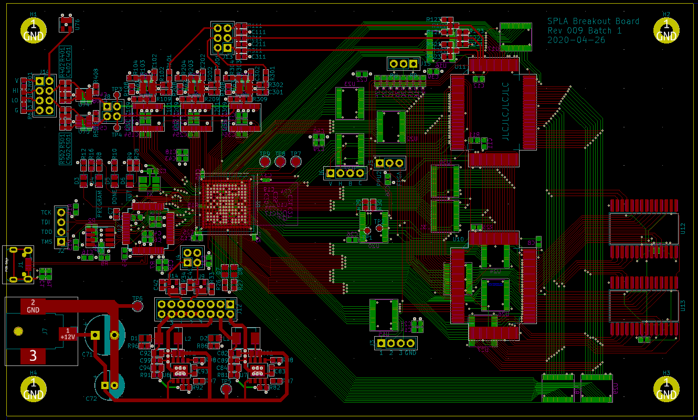

# SPLA: Super Nintendo PPU Logic Analyzer

The 1990-era Super Nintendo Entertainment System is a venerable gaming console,
and although its hardware is aging and hard to come by, it has long had
well-establish software emulatiot, preserving gaming history for generations to
come.

However, while the rest of the SNES hardware has been effectively
reverse-engineered by writing test programs for the CPU (sometimes taking
advantage of undocumented behavior to figure out details), one remaining
component of the console has resisted complete analysis: the "Picture
Processing Unit" chips, `PPU-1` and `PPU-2`.

The PPU chips are together responsible for managing the sprites, backgrounds,
and palettes for each frame of a game's video output, and produce the analog
scanline signal in realtime, which then appears on the
player's TV.  However, the output video signals (and video ram bus) are
entirely inaccessible to SNES CPU, thus making analysis of the exact timing
details of these chips difficult or impossible.

A very few games for the SNES (particularly *Air Strike Patrol*) use the SNES
video hardware in unexpected ways, which depend on the detailed timing of the
PPU chips during scanline rendering.  This makes accurately emulating these
games' graphics difficult -- emulator developers have to manually compare
emulator output with what the game actually shows on the screen, and try to
guess how the PPU evaluates these unusual configurations.  Without complete
understanding of the chips operation, this process degenerates into a
frustruating game of whack-a-mole.

To be confident that we have faithfully reproduced the entire SNES, we need to
characterize all the PPU outputs at the level of individual clock cycles, and
rigorously compare the behavior of a software emulator to that of the actual,
physical chips.

This project is intended to design a breakout circuit board, integrating the
SNES PPU chips from a real vintage SNES console, combined with surrounding
modern hardware, to effectively form a >100-pin-wide digital logic analyzer,
combined with single-frame analog video capture system.  With this board built,
and sufficient supporting software written, it should be possible to
experimentally characterize the entire operation of the PPU chips, thus
producing a completely cycle-accurate emulation of the SNES video hardware.

</img>

## Current status

* Design stabilized complete.
* Schematic complete.
* PCB layout complete.
* Schematic and PCB review complete (enough).
* Manufacturing partially started.
  * Most "large" chips ordered and arrived.
* Software started.
* Lab setup partially complete.

## Design components

* The USB interface to a host PC is based on an FTDI `FT2232H` chip, which can
  drive up to 60MBps (USB 2.0 "Full Speed" maximum throughput).
* A Lattice `ECP5` FPGA, which forms the central brains of the board.
* Both SNES `PPU` chips, and their corresponding video SRAM chips (which are
  standard 32KiB 8-bit SRAM chips, but are old enough that they're hard to
  source).
* A whole bunch of 3.3V / 5V level shifter chips (`74LVC8T245`), as the SNES
  chips are 5V TTL, but almost everything modern is 3.3V at most.
* Three `ADC1173` high-speed 8-bit analog-to-digital converter chips, to
  capture the analog RGB signal output and convert it back to digital for
  analysis. This also requires a handful (5) of `LMH6611` opamps to drive the
  ADC inputs and establish reliable references.

## References

* [Original post that inspired this project](https://byuu.org/articles/edge-of-emulation)
* [Ars Technica Article](https://arstechnica.com/gaming/2020/04/how-snes-emulators-got-a-few-pixels-from-complete-perfection/)
